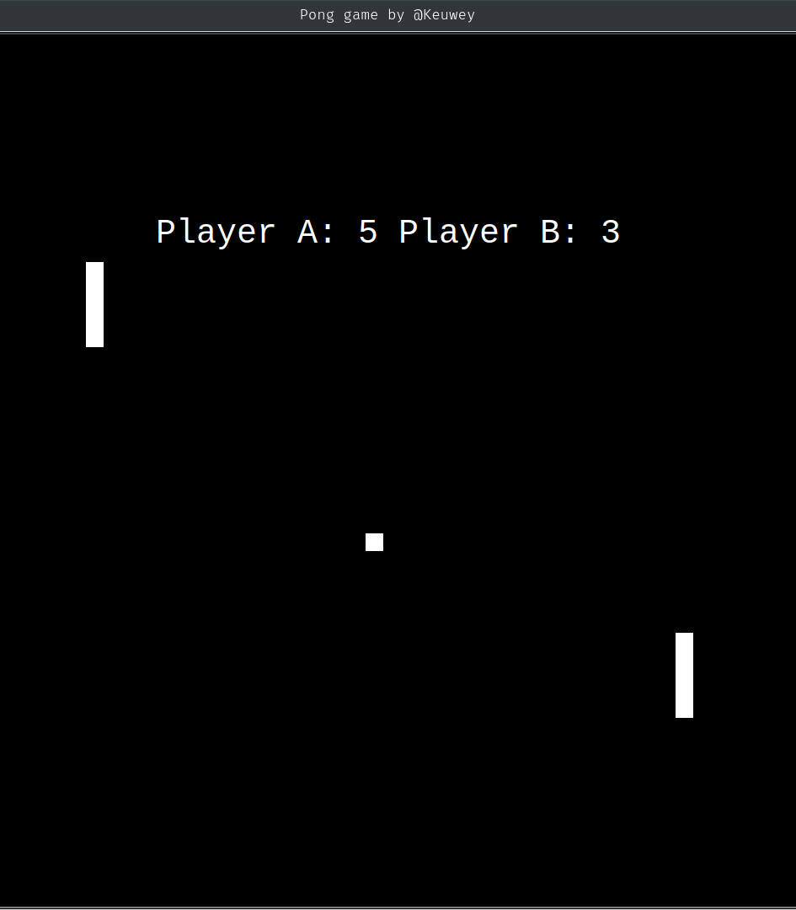

# Python Pong Game

This is a Python implementation of the iconic pong game, originally launched to arcade.


## Features

- Ball movement speed is increased as one of the players scores (not work so well yet)
- Fullscreen mode (soon)
- Cross platform
## Deployment

To deploy this project, first clone this repo 

```bash
  git clone https://github.com/keuwey/pong-game-python.git
```
Then run

```bash
  cd pong_game-python
  python pong_game.py
```

### Usage

Player nº 1 uses `w` and `s` to move the paddle up and down, and the player nº 2 uses the arrow keys `up` and `down` `(↑)` `(↓)` to move the paddle up and down.
## Authors

[Kevin Halley](https://www.github.com/keuwey)


## Contributing

Contributions are always welcome!

If you want to contribute to this little project, open an issue and let me know your thoughts.

## Screnshots


